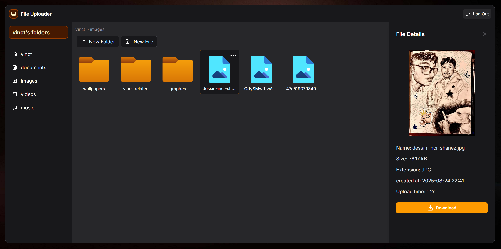
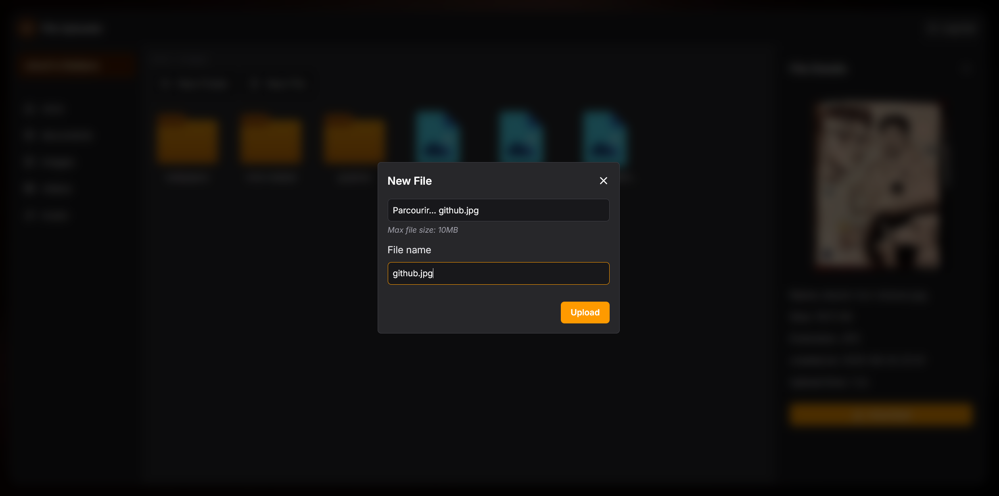
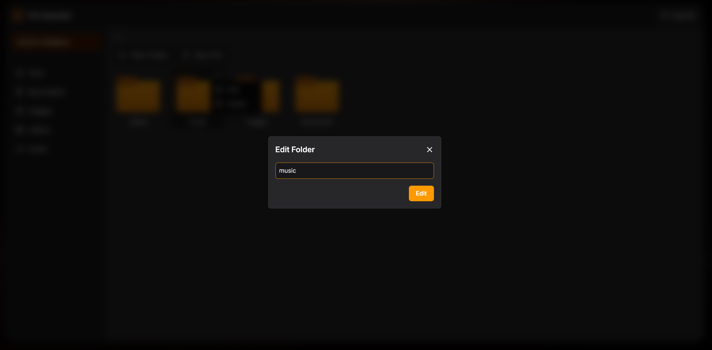
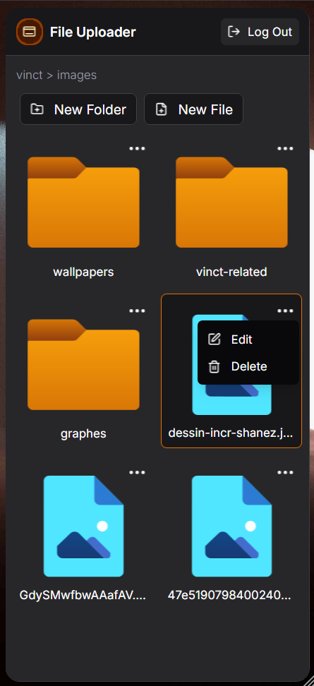
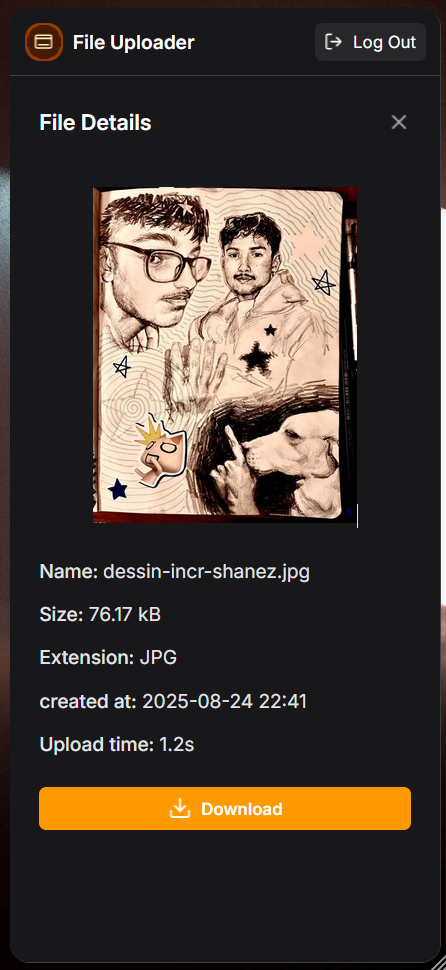

# File Uploader

<p align="center">
  
</p>

## Description

This project is a full-stack File Uploader web application built as part of [The Odin Project](https://www.theodinproject.com/) curriculum. It allows users to upload, organize, and manage files and folders in a cloud environment. The project was a hands-on learning experience with modern backend and cloud technologies, including Prisma ORM and Supabase Storage.

## Features

- **User Authentication**: Secure signup and login system.
- **File & Folder Management**: Upload, organize, and delete files and folders in a user-friendly interface.
- **Cloud Storage**: Files are stored in Supabase Storage buckets for scalability and reliability.
- **Progress Bar**: Real-time upload progress feedback for a smooth user experience.
- **Prisma ORM**: Robust database access and management using Prisma with PostgreSQL.
- **Responsive UI**: Clean, modern interface built with Tailwind CSS and EJS templates.
- **File Details Sidebar**: View file metadata, download links, and more in a right sidebar.
- **Validation & Error Handling**: Input validation and user-friendly error messages throughout the app.

## What I Learned

- Integrating Supabase Storage for secure, scalable file uploads and downloads
- Using Prisma ORM for database modeling and queries
- Implementing file upload progress bars with XMLHttpRequest
- Secure file handling and validation in Express.js
- Building modular, maintainable code with EJS partials and controllers
- Managing cloud storage permissions and policies

## Technologies Used

- **Backend**: Node.js, Express.js
- **Database**: PostgreSQL with Prisma ORM
- **Cloud Storage**: Supabase Storage
- **Frontend**: EJS, Tailwind CSS, Vanilla JS
- **Validation**: express-validator
- **Icons**: Lucide
- **Other**: Bun (runtime), Multer (file upload middleware)

## File Structure

```
client/                # Frontend entry (optional)
prisma/                # Prisma schema and migrations
public/                # Static assets (CSS, images, JS)
src/
  controllers/         # Express route handlers
  db/                  # Prisma queries and DB logic
  routes/              # Express routers
  scripts/             # Utilities, Supabase client, etc.
  views/               # EJS templates and partials
```

## Installation & Setup

1. **Clone the repository:**
	```bash
	git clone https://github.com/Vincent0103/file-uploader.git
	cd file-uploader
	```

2. **Install dependencies:**
	```bash
	bun install
	```

3. **Set up environment variables in `.env`:**
	```env
	PORT=3000
	DATABASE_URL=your_postgres_url
	SUPABASE_URL=your_supabase_url
	SUPABASE_ANON_KEY=your_supabase_anon_key
	```

4. **Run database migrations:**
	```bash
	bun run prisma migrate deploy
	```

5. **Start the application:**
	```bash
	bun run src/app.js
	```

## Usage

- Sign up or log in to your account
- Create folders and upload files
- View file details and download files from the sidebar
- Delete files or folders as needed

## Screenshots

<p align="center">
  
</p>
<p align="center">
  
</p>
<p align="center">
  
</p>
<p align="center">
  
</p>
<p align="center">
  
</p>

## Security Considerations

- All file uploads are validated and sanitized
- Supabase Storage policies restrict access to authenticated users
- Passwords are securely hashed (if authentication is enabled)

## License

This project is licensed under the MIT License.

## Acknowledgements

- [The Odin Project](https://www.theodinproject.com/)
- [Supabase](https://supabase.com/)
- [Prisma](https://www.prisma.io/)
- [Tailwind CSS](https://tailwindcss.com/)
- [Lucide Icons](https://lucide.dev/)
